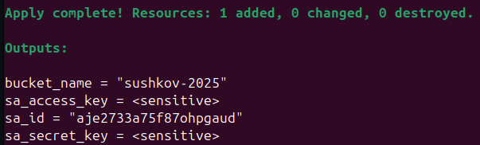

## Создание сервисного аккаунта и S3-бакета

В директории `01-sa_bucket` создаём:
- **Сервисный аккаунт** ([sa.tf](01-sa_bucket/sa.tf)): Настраиваем аккаунт с правами `storage.admin` (для управления бакетом), `compute.editor` (для ВМ), `vpc.admin` (для сетей) и `kms.keys.encrypterDecrypter` (для шифрования бакета).
- **S3-бакет** ([bucket.tf](01-sa_bucket/bucket.tf)): Создаём бакет для хранения состояния Terraform с шифрованием через KMS.

В файле [outputs.tf](01-sa_bucket/outputs.tf) определяем переменные для использования в директории `02-infra`:
- `sa_access_key`: Ключ доступа сервисного аккаунта для S3.
- `sa_secret_key`: Секретный ключ для S3.
- `bucket_name`: Имя бакета.

Эти значения подтягиваются скриптом [init_backend.sh](02-infra/init_backend.sh) для настройки S3-бэкенда.

Инициализируем переменные, сохраняем в файл <filename>.auto.tfvars, пример [здесь](01-sa_bucket/auto.tfvars.example)

### Запуск

В директории `01-sa_bucket` выполняем:
```bash
terraform init
terraform validate
terraform plan
terraform apply
```

