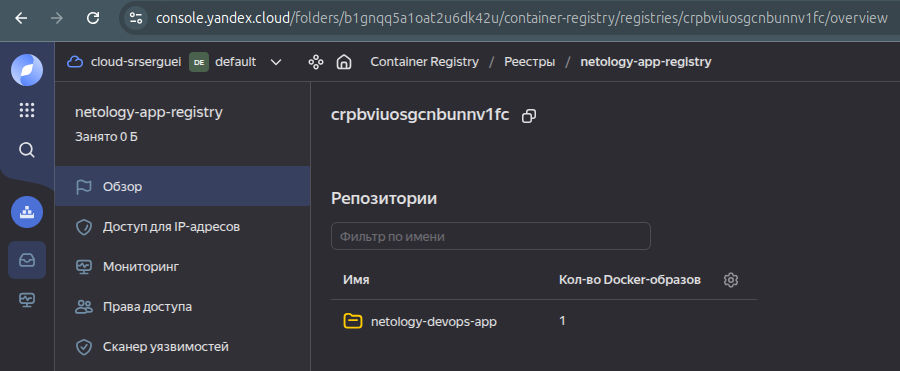

## Создание тестового приложения
### Подготовка приложения
Содаём [репозиторий](https://github.com/SergueiMoscow/DevOps_nginx_page) отдельно от этого проекта

Прописываем [Dockerfile](https://github.com/SergueiMoscow/DevOps_nginx_page/blob/main/Dockerfile), пишем [главную единственную страницу](https://github.com/SergueiMoscow/DevOps_nginx_page/blob/main/html/index.html) и [config для nginx](https://github.com/SergueiMoscow/DevOps_nginx_page/blob/main/config/nginx.conf)


### Тестируем локально:  

Собираем контейнер:  

```bash
docker build -t netology-devops-app .
```
Запускаем:  
```
docker run -d -p 80:80 --name container-netology-devops-app netology-devops-app
```
Проверяем:  

Удаляем:  
```bash
docker stop container-netology-devops-app
docker rm container-netology-devops-app
docker rmi netology-devops-app
```
### Подготовка registry
Создаём [container_registry.tf](03-registry/container_registry.tf)

Для нового сервисного аккаунта создаём ключ:  
``` bash
yc iam key create \
    --service-account-id $(terraform output -raw service_account_id) \
    --output registry_sa_key.json
```
Конфигурируем Docker для Yandex Container Registry:
```
yc container registry configure-docker
```
### Создание образа в Yandex Container Registry
Собираем образ (в директории с приложением)
```
registry_id=$(terraform -chdir=../Diplom/03-registry output -raw registry_id)
docker build -t cr.yandex/$registry_id/netology-devops-app:latest .
docker push cr.yandex/$registry_id/netology-devops-app:latest
```
Проверяем в консоли YC:  

