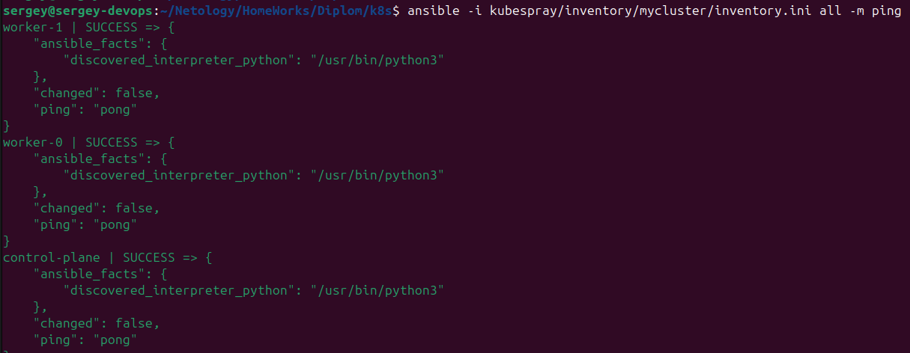
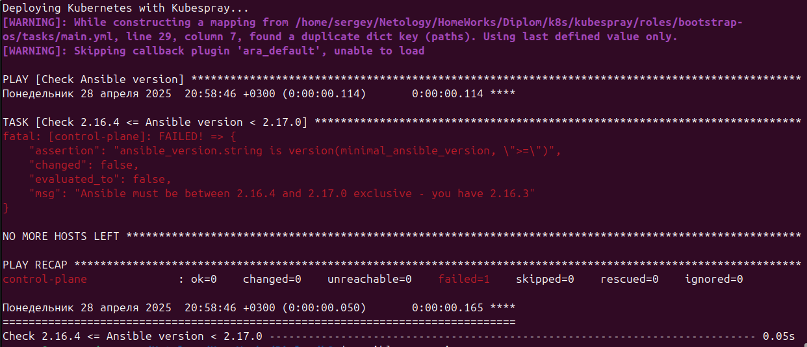
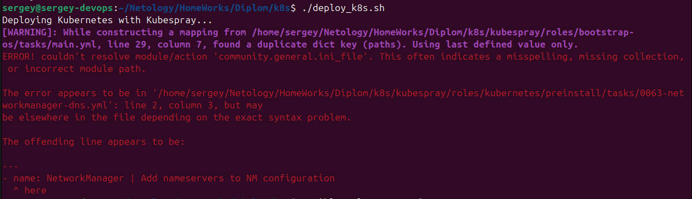
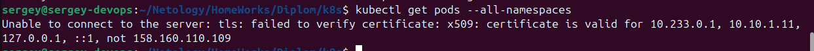
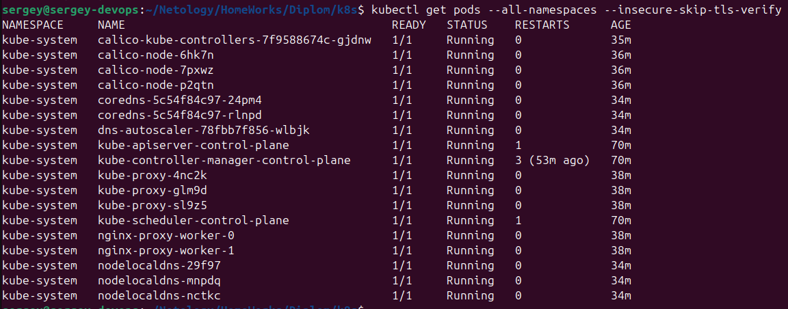
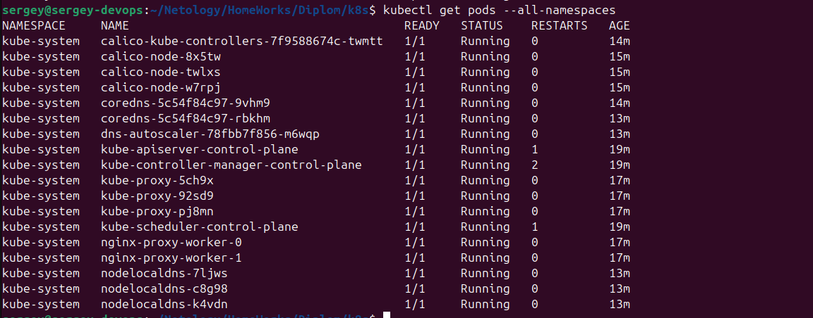

### Запуск
В директории `02-infra` должен отработать `terraform apply`, он записывает IP созданных ВМ в inventory.
Можно проверить доступность ВМ:
```bash
ansible -i kubespray/inventory/mycluster/inventory.ini all -m ping
```
Результат:


Запускаем 
```
./deploy_k8s.sh
```
Указывает на старую версию Ansible


Нужно обновить.

Если нет какой-то коллекции:  


Далее, пришлось установить ещё коллекции
```
ansible-galaxy collection install community.general
ansible-galaxy collection install kubernetes.core
ansible-galaxy collection install ansible.utils
ansible-galaxy collection install community.crypto
```

Kubespray не установил сертификат для внешнего IP, поэтому:  


Но так работает:
```
kubectl get pods --all-namespaces --insecure-skip-tls-verify
```


Пробуем добавить строку
```bash
sed -i "/supplementary_addresses_in_ssl_keys:/ s/.*/supplementary_addresses_in_ssl_keys: [\"$control_plane_ip\"]/" kubespray/inventory/mycluster/group_vars/k8s_cluster/k8s-cluster.yml
```
в файл [deloy_k8s.sh](04-k8s/deploy_k8s.sh)

Это решило проблему, и, после повторного создания инфраструктуры и запуска [`deploy_k8s.sh`](04-k8s/deploy_k8s.sh) команда `kubectl get pods --all-namespaces` отработала корректно:  

