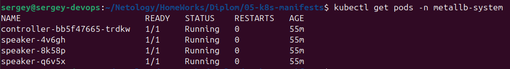
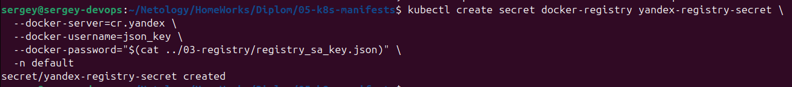
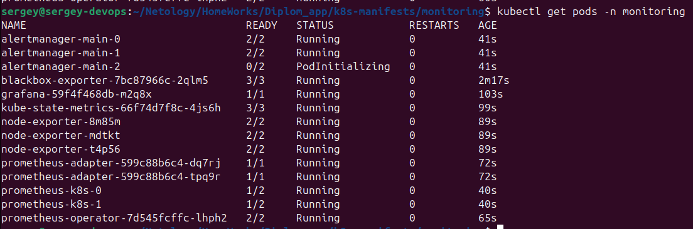

## Настройка кластера
### Установка и настройка балансировщика
[Документация](https://metallb.io/installation/)
Согласно документации strictARP должен быть true в kube-proxy:
```yaml
apiVersion: kubeproxy.config.k8s.io/v1alpha1
kind: KubeProxyConfiguration
mode: "ipvs"
ipvs:
  strictARP: true
```
 можно проверить так:
```bash
kubectl describe configmap -n kube-system kube-proxy | grep strictARP
```
Или, как сказано в документации:


```bash
# see what changes would be made, returns nonzero returncode if different
kubectl get configmap kube-proxy -n kube-system -o yaml | \
sed -e "s/strictARP: false/strictARP: true/" | \
kubectl diff -f - -n kube-system
```

Если он false, то меняем:
```bash
# actually apply the changes, returns nonzero returncode on errors only
kubectl get configmap kube-proxy -n kube-system -o yaml | \
sed -e "s/strictARP: false/strictARP: true/" | \
kubectl apply -f - -n kube-system
```

Только после этого ставим metallb:
```bash
kubectl apply -f https://raw.githubusercontent.com/metallb/metallb/v0.14.9/config/manifests/metallb-native.yaml
```

Проверяем:
```bash
kubectl get pods -n metallb-system
```


Далее, необходимо сконфигурировать metallb:  
`[Документация](https://metallb.io/configuration/)`

# sss подкорректировать
Создаём [metallb-config.yaml](05-k8s-manifests/metallb/metallb-config.yaml):

Учитывая, что наши IP будут меняться, и нам их нужно брать из созданного на этапе создания инфраструктуры [infra-outputs.json](infra-outputs.json), создаём [generate-metallb-config.sh](05-k8s-manifests/generate-metallb-config.sh).

---
**Важно:** В [metallb-config.yaml](05-k8s-manifests/metallb/metallb-config.yaml) в spec.addresses должны указваться только worker ноды.
**Важно:** В [ingress приложения] в spec.rules.host должно быть настроенное доменное имя. Имя можно настроить на адрес любой доступной ноды.

Можно проверить IP пула адресов metallb:
```bash
kubectl describe ipaddresspool -n metallb-system yc-pool
```


## Деплой приложения
Для деплоея приложения создаём секрет:
```bash
kubectl create secret docker-registry yandex-registry-secret \
  --docker-server=cr.yandex \
  --docker-username=json_key \
  --docker-password="$(cat ../03-registry/registry_sa_key.json)" \
  -n default
```


Деплоим app, service, ingress:
```bash
kubectl apply -f app/deployment.yaml
kubectl apply -f app/service.yaml
kubectl apply -f app/ingress.yaml

```

### Подготовка мониторинга
Будем использовать пакет [kube-prometheus](https://github.com/prometheus-operator/kube-prometheus)

Скачиваем манифесты kube-prometheus (версия 0.14.0), выполняем в директории с приложением:
```
wget https://github.com/prometheus-operator/kube-prometheus/archive/v0.14.0.tar.gz
tar -xzf v0.14.0.tar.gz
mv kube-prometheus-0.14.0/manifests .
rm -rf kube-prometheus-0.14.0 v0.14.0.tar.gz
```

Применяем манифесты:  
```
kubectl apply --server-side -f monitoring/manifests/setup
kubectl wait \
	--for condition=Established \
	--all CustomResourceDefinition \
	--namespace=monitoring
kubectl apply -f monitoring/manifests/
```

Проверяем:
```
kubectl get pods -n monitoring
```


kubectl patch deployment -n monitoring grafana --patch-file monitoring/grafana-deployment-patch.yaml

kubectl apply -f monitoring/grafana-ingress.yaml

kubectl apply -f monitoring/grafana-networkpolicy.yaml
