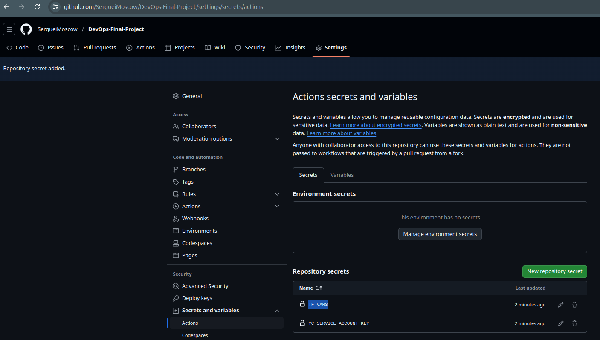
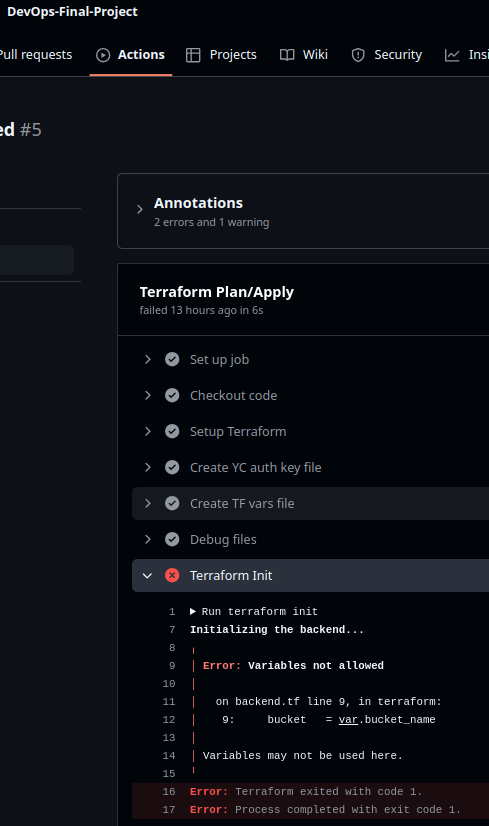
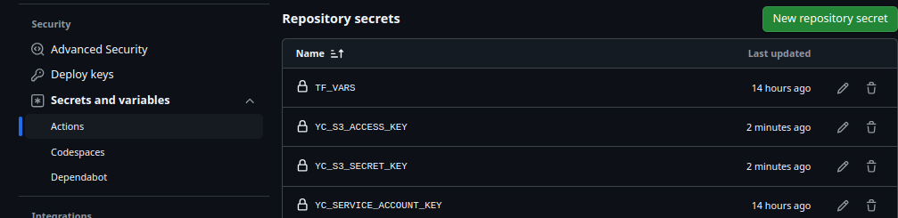
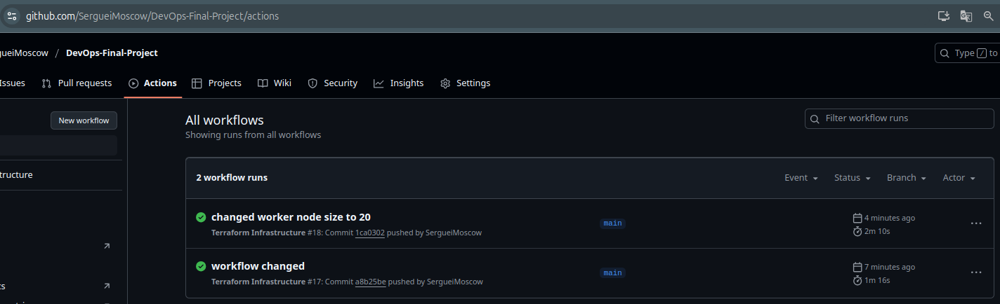
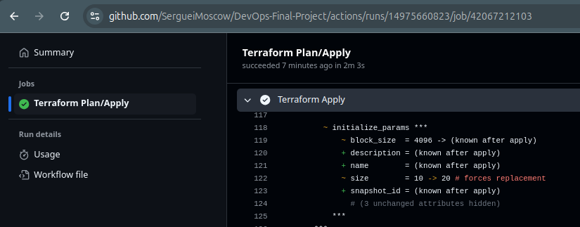
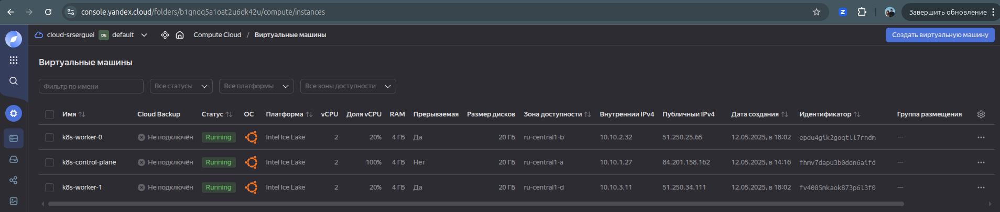

## Создание CI/CD для инфраструктуры
Создаём секреты в GitHub Actions:
1. YC_SERVICE_ACCOUNT_KEY с json содержимым фала ключа.
2. TF_VARS с содержимым файла main.auto.tfvars



Создаём [workflow](.github/workflows/terraform.yml)

Получаем ошибку:  


Т.к. локально мы инициализируем backend с помощью `init_backend.sh`, то в пайплайне нужно делать что-то аналогичное. Для этого создаём ещё 2 секрета:
1. YC_S3_ACCESS_KEY
2. YC_S3_SECRET_KEY
Bucket_name будем вытаскивать из TF_VARS:
```yaml
      - name: Extract bucket name
        id: extract_bucket
        run: |
          BUCKET_NAME=$(echo "${{ secrets.TF_VARS }}" | grep 'bucket_name' | awk -F'"' '{print $2}')
          echo "bucket_name=${BUCKET_NAME}" >> $GITHUB_OUTPUT
```


Теперь CI/CD работает:  


Лог из GitHub Actions:  


Проверка с изменением размера worker нод с 10 на 20 ГБ сработала:  

