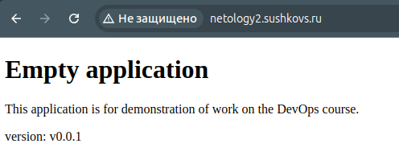
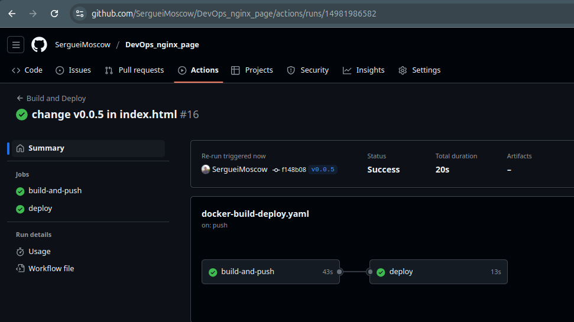
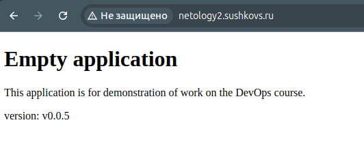

## CI/CD приложения
Пишем [workflow](https://github.com/SergueiMoscow/DevOps_nginx_page/blob/main/.github/workflows/docker-build-deploy.yaml)

Добавляем строку с версией в файл index.html

Создав заново всю инфраструктуру, включая деплой приложения, видим, что задеплоилась новая версия (добавлена строка с версией)



Меняем версию в index.html

Ставим тег:
```bash
git tag -a v0.0.5 -m "Release version 0.0.5"
git push origin v0.0.5
```



Задеплоенное приложение также обновилось:


