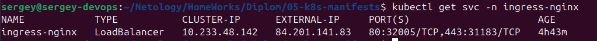
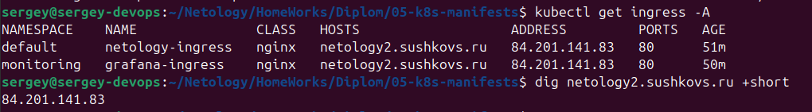
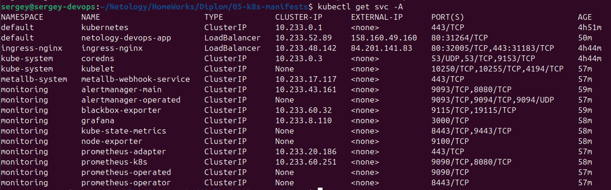
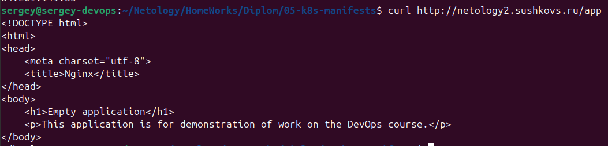
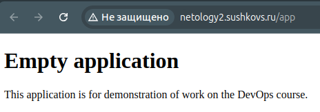

[Задание](https://github.com/netology-code/devops-diplom-yandexcloud)

## Создание облачной инфраструктуры

### Требования для запуска
- Установленный Terraform (версия ≥ 1.5).
- Доступ к Яндекс.Облаку с файлом ключей `~/.yc_authorized_key.json`.
- Настроенные переменные по примерам из [01-sa_bucket](01-sa_bucket/auto.tfvars.example) и [02-infra](02-infra/auto.tfvars.example) в файлах `<filename>.auto.tfvars`.
- Приватный и публичный ключи `id_ed25519` в `~/.ssh/`

### Подготовка

Для управления инфраструктурой создаём две отдельные директории:
- **[01-sa_bucket](01-sa_bucket)**: Для создания сервисного аккаунта и S3-бакета, используемого как бэкенд для хранения состояния Terraform.
- **[02-infra](02-infra)**: Для создания основной инфраструктуры (VPC и подсетей).
- **[03-registry](03-registry)**: Для создания контенера и публикации его в Yandex Registry.
- **[04-k8s](04-k8s)**: Установка kubernetes на виртуальных машинах.
- **[05-k8s-manifests](05-k8s-manifests)**: Для манифестов Kubernetes.


# 01-sa_bucket.md
# 02-infra.md
# 03-registry.md
# 04-k8s.md
# 05-k8s-manifests.md


## Подготовка cистемы мониторинга

### Подготовка мониторинга
Будем использовать пакет [kube-prometheus](https://github.com/prometheus-operator/kube-prometheus)

Скачиваем манифесты kube-prometheus (версия 0.14.0), выполняем в директории с приложением:
```
wget https://github.com/prometheus-operator/kube-prometheus/archive/v0.14.0.tar.gz
tar -xzf v0.14.0.tar.gz
mv kube-prometheus-0.14.0/manifests .
rm -rf kube-prometheus-0.14.0 v0.14.0.tar.gz
```

Применяем манифесты:  
```
kubectl apply --server-side -f manifests/setup
kubectl wait \
	--for condition=Established \
	--all CustomResourceDefinition \
	--namespace=monitoring
kubectl apply -f manifests/
```

Проверяем:
```
kubectl get pods -n monitoring
```


Ставим ingress:
```
kubectl apply -f https://raw.githubusercontent.com/kubernetes/ingress-nginx/controller-v1.12.2/deploy/static/provider/cloud/deploy.yaml
```

Проверяем:  
```
kubectl get pods -n ingress-nginx
```


Создаём [grafana-deployment-patch.yaml](05-k8s-manifests/monitoring/grafana-deployment-patch.yaml), где определяем переменные для работы `Grafana` на endpoint `/grafana`, т.к. по умолчанию `Grafana` ожидает работу на корневом пути (/). Применяем его
```bash
kubectl apply -f monitoring/grafana-deployment-patch.yaml
```

Создаём [grafana-networkpolicy.yaml](05-k8s-manifests/monitoring/grafana-networkpolicy.yaml), чтобы разрешитиь входящий трафик к подам grafana.
Применяем:
```bash
kubectl apply -f monitoring/grafana-networkpolicy.yaml
```

Пишем [ingress](05-k8s-manifests/monitoring/grafana-ingress.yaml) для grafana
Применяем
```bash
kubectl apply -f monitoring/grafana-ingress.yaml
```


Проверяем поды приложения:
```bash
kubectl get pods -n default
```
[get pods -n default](images/image15.png)

Генерируем конфиг для `metallb` с помощью [generate-metallb-config.sh](05-k8s-manifests/generate-metallb-config.sh). При этом в корне проекта должен быт актуальный [infra-outputs.json](infra-outputs.json).

Проверяем конфиг для metallb [metallb-config.yaml](05-k8s-manifests/metallb/metallb-config.yaml)

Применяем
```bash
kubectl apply -f metallb/metallb-config.yaml
```

Проверяем
```bash
kubectl get ipaddresspool -n metallb-system
kubectl get l2advertisement -n metallb-system
```

После настройки MetalLB сервис ingress-nginx должен получить внешний IP:
```bash
kubectl get svc -n ingress-nginx
```



Делегируем домен на наш IP
Проверяем ingress, убеждаемся, что домен делегирован на наш IP:
```bash
kubectl get ingress -A
dig netology2.sushkovs.ru +short
```



Проверяем, что сервисы получили внешине IP:
```bash
kubectl get svc -A
```



Проверяем доступность приложений
```bash
curl http://netology2.sushkovs.ru/app
curl http://netology2.sushkovs.ru/grafana
```


Из браузера:  


kubectl apply -f grafana-networkpolicy.yaml
kubectl patch deployment -n monitoring grafana --patch-file grafana-deployment-patch.yaml
