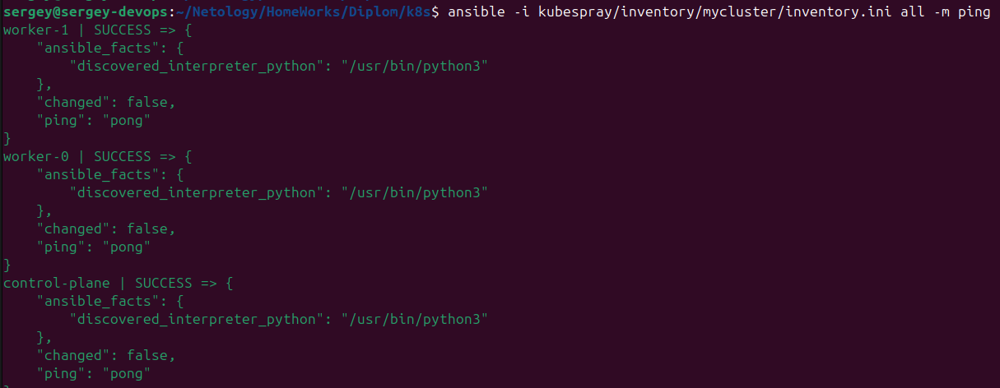

[Задание](https://github.com/netology-code/devops-diplom-yandexcloud)

## Создание облачной инфраструктуры


### Требования для запуска
- Установленный Terraform (версия ≥ 1.5).
- Доступ к Яндекс.Облаку с файлом ключей `~/.yc_authorized_key.json`.
- Настроенные переменные по примерам из [sa_bucket](sa_bucket/auto.tfvars.example) и [infra](infra/auto.tfvars.example) в файлах `<filename>.auto.tfvars`.
- Приватный и публичный ключи `id_ed25519` в `~/.ssh/`

### Подготовка

Для управления инфраструктурой создаём две отдельные директории:
- **[sa_bucket](sa_bucket)**: Для создания сервисного аккаунта и S3-бакета, используемого как бэкенд для хранения состояния Terraform.
- **[infra](infra)**: Для создания основной инфраструктуры (VPC и подсетей).

В директории `sa_bucket` создаём:
- **Сервисный аккаунт** ([sa.tf](sa_bucket/sa.tf)): Настраиваем аккаунт с правами `storage.admin` (для управления бакетом), `compute.editor` (для ВМ), `vpc.admin` (для сетей) и `kms.keys.encrypterDecrypter` (для шифрования бакета).
- **S3-бакет** ([bucket.tf](sa_bucket/bucket.tf)): Создаём бакет для хранения состояния Terraform с шифрованием через KMS.

В файле [outputs.tf](sa_bucket/outputs.tf) определяем переменные для использования в директории `infra`:
- `sa_access_key`: Ключ доступа сервисного аккаунта для S3.
- `sa_secret_key`: Секретный ключ для S3.
- `bucket_name`: Имя бакета.

Эти значения подтягиваются скриптом [init_backend.sh](infra/init_backend.sh) для настройки S3-бэкенда.

Инициализируем переменные, сохраняем в файл <filename>.auto.tfvars, пример [здесь](sa_bucket/auto.tfvars.example)

### Запуск

В директории `sa_bucket` выполняем:
```bash
terraform init
terraform validate
terraform plan
terraform apply
```


В директории `infra` создаём скрипт [init_backend.sh](infra/init_backend.sh), который:
- Переходит в директорию `sa_bucket`.
- Получает значения `sa_access_key`, `sa_secret_key` и `bucket_name` из outputs.
- Инициализирует Terraform с S3-бэкендом, используя эти значения.

Запуск скрипта:
```bash
./init_backend.sh
```
Это автоматизирует настройку бэкенда, исключая ручной ввод ключей.

В файле [network.tf](infra/network.tf) создаём:
- VPC (`my_network`).
- Три подсети в зонах `ru-central1-a`, `ru-central1-b`, `ru-central1-d` с CIDR-блоками `10.10.1.0/24`, `10.10.2.0/24`, `10.10.3.0/24`.  

Зоны и CIDR-блоки определены в переменных в [variables.tf](infra/variables.tf)

В файле [backend.tf](infra/backend.tf) настраиваем S3-бэкенд для хранения состояния `terraform.tfstate` в бакете, созданном в `sa_bucket`.

В директории `infra` выполняем:
```bash
./init_backend.sh  # Инициализация бэкенда вместо terraform init с подтягиванием ключей
terraform validate
terraform plan
terraform apply
```

## Создание Kubernetes кластера
### Подготовка
Создаём [k8s_nodes.tf](infra/k8s_nodes.tf)

Для подтягивания ключей доступа к серверам подтягиваем существующий `ed_25519.pub` публичный ключ в [locals.tf](infra/locals.tf)

Создаём директорию для [k8s](k8s) для `ansible-playbook`.

Переходим в неё и колнируем `kubespray`
```
git clone https://github.com/kubernetes-sigs/kubespray
```

Создаём `inventory` и копируем туда пример конфигурации
```
cd kubespray
mkdir -p inventory/mycluster
cp -r inventory/sample/group_vars inventory/mycluster/
```

Создаём [deploy_k8s.sh](k8s/deploy_k8s.sh) и даём права на выполнение
```
chmod +x deploy_k8s.sh
```
### Запуск
В директории `infra` должен отработать `terraform apply`, он записывает IP созданных ВМ в inventory.
Можно проверить доступность ВМ:
```bash
ansible -i kubespray/inventory/mycluster/inventory.ini all -m ping
```
Результат будет примерно таким:


Запускаем 
```
./deploy_k8s.sh

```
Указывает на старую версию Ansible


Нужно обновить.

Если нет какой-то коллекции:  


Далее, пришлось установить ещё коллекции
```
ansible-galaxy collection install community.general
ansible-galaxy collection install kubernetes.core
ansible-galaxy collection install ansible.utils
ansible-galaxy collection install community.crypto
```

Kubespray не установил сертификат для внешнего IP, поэтому:  


Но так работает:
```
kubectl get pods --all-namespaces --insecure-skip-tls-verify
```


Пробуем добавить строку
```bash
sed -i "/supplementary_addresses_in_ssl_keys:/ s/.*/supplementary_addresses_in_ssl_keys: [\"$control_plane_ip\"]/" kubespray/inventory/mycluster/group_vars/k8s_cluster/k8s-cluster.yml
```
в файл [deloy_k8s.sh](k8s/deploy_k8s.sh)

Это решило проблему, и, после повторного создания инфраструктуры и запуска [`deploy_k8s.sh`](k8s/deploy_k8s.sh) команда `kubectl get pods --all-namespaces` отработала корректно:  

