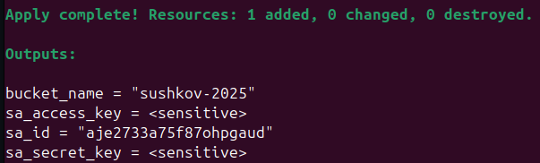
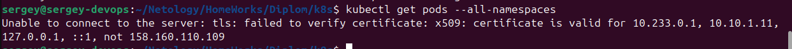
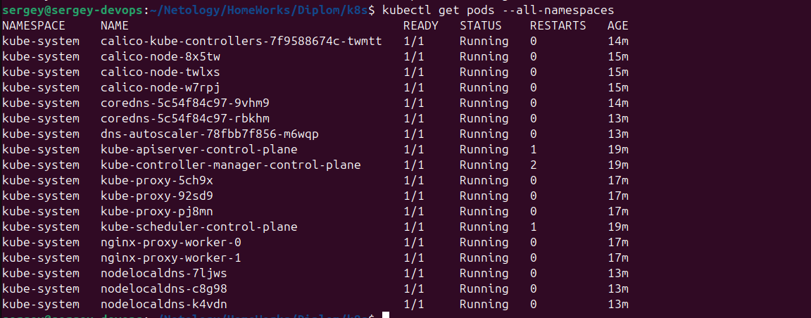
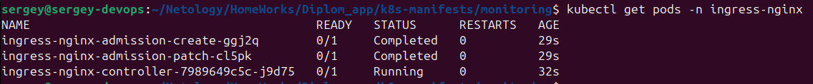
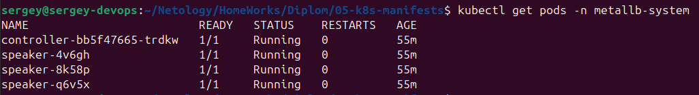
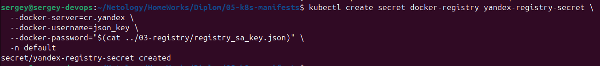

[Задание](https://github.com/netology-code/devops-diplom-yandexcloud)

## Создание облачной инфраструктуры


### Требования для запуска
- Установленный Terraform (версия ≥ 1.5).
- Доступ к Яндекс.Облаку с файлом ключей `~/.yc_authorized_key.json`.
- Настроенные переменные по примерам из [01-sa_bucket](01-sa_bucket/auto.tfvars.example) и [02-infra](02-infra/auto.tfvars.example) в файлах `<filename>.auto.tfvars`.
- Приватный и публичный ключи `id_ed25519` в `~/.ssh/`

### Подготовка

Для управления инфраструктурой создаём две отдельные директории:
- **[01-sa_bucket](01-sa_bucket)**: Для создания сервисного аккаунта и S3-бакета, используемого как бэкенд для хранения состояния Terraform.
- **[02-infra](02-infra)**: Для создания основной инфраструктуры (VPC и подсетей).

В директории `01-sa_bucket` создаём:
- **Сервисный аккаунт** ([sa.tf](01-sa_bucket/sa.tf)): Настраиваем аккаунт с правами `storage.admin` (для управления бакетом), `compute.editor` (для ВМ), `vpc.admin` (для сетей) и `kms.keys.encrypterDecrypter` (для шифрования бакета).
- **S3-бакет** ([bucket.tf](01-sa_bucket/bucket.tf)): Создаём бакет для хранения состояния Terraform с шифрованием через KMS.

В файле [outputs.tf](01-sa_bucket/outputs.tf) определяем переменные для использования в директории `02-infra`:
- `sa_access_key`: Ключ доступа сервисного аккаунта для S3.
- `sa_secret_key`: Секретный ключ для S3.
- `bucket_name`: Имя бакета.

Эти значения подтягиваются скриптом [init_backend.sh](02-infra/init_backend.sh) для настройки S3-бэкенда.

Инициализируем переменные, сохраняем в файл <filename>.auto.tfvars, пример [здесь](01-sa_bucket/auto.tfvars.example)

### Запуск

В директории `01-sa_bucket` выполняем:
```bash
terraform init
terraform validate
terraform plan
terraform apply
```



В директории `02-infra` создаём скрипт [init_backend.sh](02-infra/init_backend.sh), который:
- Переходит в директорию `01-sa_bucket`.
- Получает значения `sa_access_key`, `sa_secret_key` и `bucket_name` из outputs.
- Инициализирует Terraform с S3-бэкендом, используя эти значения.

Запуск скрипта:
```bash
./init_backend.sh
```
Это автоматизирует настройку бэкенда, исключая ручной ввод ключей.

В файле [network.tf](02-infra/network.tf) создаём:
- VPC (`my_network`).
- Три подсети в зонах `ru-central1-a`, `ru-central1-b`, `ru-central1-d` с CIDR-блоками `10.10.1.0/24`, `10.10.2.0/24`, `10.10.3.0/24`.  

Зоны и CIDR-блоки определены в переменных в [variables.tf](02-infra/variables.tf)

В файле [backend.tf](02-infra/backend.tf) настраиваем S3-бэкенд для хранения состояния `terraform.tfstate` в бакете, созданном в `01-sa_bucket`.

В директории `02-infra` выполняем:
```bash
./init_backend.sh  # Инициализация бэкенда вместо terraform init с подтягиванием ключей
terraform validate
terraform plan
terraform apply
```

Генерируем JSON с output в корне проекта:
```bash
terraform output -json > ../infra-outputs.json
```


## Создание Kubernetes кластера
### Подготовка
Создаём [k8s_nodes.tf](02-infra/k8s_nodes.tf)

Для подтягивания ключей доступа к серверам подтягиваем существующий `ed_25519.pub` публичный ключ в [locals.tf](02-infra/locals.tf)

Создаём директорию для [04-k8s](04-k8s) для `ansible-playbook`.

Переходим в неё и колнируем `kubespray`
```
git clone https://github.com/kubernetes-sigs/kubespray
```

Создаём `inventory` и копируем туда пример конфигурации
```
cd kubespray
mkdir -p inventory/mycluster
cp -r inventory/sample/group_vars inventory/mycluster/
```

Создаём [deploy_k8s.sh](04-k8s/deploy_k8s.sh) и даём права на выполнение
```
chmod +x deploy_k8s.sh
```
### Запуск
В директории `02-infra` должен отработать `terraform apply`, он записывает IP созданных ВМ в inventory.
Можно проверить доступность ВМ:
```bash
ansible -i kubespray/inventory/mycluster/inventory.ini all -m ping
```
Результат:


Запускаем 
```
./deploy_k8s.sh
```
Указывает на старую версию Ansible


Нужно обновить.

Если нет какой-то коллекции:  


Далее, пришлось установить ещё коллекции
```
ansible-galaxy collection install community.general
ansible-galaxy collection install kubernetes.core
ansible-galaxy collection install ansible.utils
ansible-galaxy collection install community.crypto
```

Kubespray не установил сертификат для внешнего IP, поэтому:  


Но так работает:
```
kubectl get pods --all-namespaces --insecure-skip-tls-verify
```


Пробуем добавить строку
```bash
sed -i "/supplementary_addresses_in_ssl_keys:/ s/.*/supplementary_addresses_in_ssl_keys: [\"$control_plane_ip\"]/" kubespray/inventory/mycluster/group_vars/k8s_cluster/k8s-cluster.yml
```
в файл [deloy_k8s.sh](04-k8s/deploy_k8s.sh)

Это решило проблему, и, после повторного создания инфраструктуры и запуска [`deploy_k8s.sh`](04-k8s/deploy_k8s.sh) команда `kubectl get pods --all-namespaces` отработала корректно:  


## Создание тестового приложения
### Подготовка приложения
Содаём [репозиторий](https://github.com/SergueiMoscow/DevOps_nginx_page) отдельно от этого проекта

Прописываем [Dockerfile](https://github.com/SergueiMoscow/DevOps_nginx_page/blob/main/Dockerfile), пишем [главную единственную страницу](https://github.com/SergueiMoscow/DevOps_nginx_page/blob/main/html/index.html) и [config для nginx](https://github.com/SergueiMoscow/DevOps_nginx_page/blob/main/config/nginx.conf)


### Тестируем локально:  

Собираем контейнер:  

```bash
docker build -t netology-devops-app .
```
Запускаем:  
```
docker run -d -p 80:80 --name container-netology-devops-app netology-devops-app
```
Проверяем:  

Удаляем:  
```bash
docker stop container-netology-devops-app
docker rm container-netology-devops-app
docker rmi netology-devops-app
```
### Подготовка registry
Создаём [container_registry.tf](03-registry/container_registry.tf)

Для нового сервисного аккаунта создаём ключ:  
``` bash
yc iam key create \
    --service-account-id $(terraform output -raw service_account_id) \
    --output registry_sa_key.json
```
Конфигурируем Docker для Yandex Container Registry:
```
yc container registry configure-docker
```
### Создание образа в Yandex Container Registry
Собираем образ (в директории с приложением)
```
registry_id=$(terraform -chdir=../Diplom/03-registry output -raw registry_id)
docker build -t cr.yandex/$registry_id/netology-devops-app:latest .
docker push cr.yandex/$registry_id/netology-devops-app:latest
```
Проверяем в консоли YC:  


## Подготовка cистемы мониторинга и деплой приложения

### Подготовка мониторинга
Будем использовать пакет [kube-prometheus](https://github.com/prometheus-operator/kube-prometheus)

Скачиваем манифесты kube-prometheus (версия 0.14.0), выполняем в директории с приложением:
```
wget https://github.com/prometheus-operator/kube-prometheus/archive/v0.14.0.tar.gz
tar -xzf v0.14.0.tar.gz
mv kube-prometheus-0.14.0/manifests .
rm -rf kube-prometheus-0.14.0 v0.14.0.tar.gz
```

Применяем манифесты:  
```
kubectl apply --server-side -f manifests/setup
kubectl wait \
	--for condition=Established \
	--all CustomResourceDefinition \
	--namespace=monitoring
kubectl apply -f manifests/
```

Проверяем:
```
kubectl get pods -n monitoring
```


Ставим ingress:
```
kubectl apply -f https://raw.githubusercontent.com/kubernetes/ingress-nginx/controller-v1.12.2/deploy/static/provider/cloud/deploy.yaml
```

Проверяем:  
```
kubectl get pods -n ingress-nginx
```



Подготавливаем metallb:

Ставим metallb:
```bash
kubectl apply -f https://raw.githubusercontent.com/metallb/metallb/v0.14.9/config/manifests/metallb-native.yaml
```

Проверяем:
```bash
kubectl get pods -n metallb-system
```


Перед деплоем приложения создаём секрет:
```bash
kubectl create secret docker-registry yandex-registry-secret \
  --docker-server=cr.yandex \
  --docker-username=json_key \
  --docker-password="$(cat ../03-registry/registry_sa_key.json)" \
  -n default
```


Деплоим app, service, ingress:
```bash
kubectl apply -f app/deployment.yaml
kubectl apply -f app/service.yaml
kubectl apply -f app/ingress.yaml

```

Создаём [grafana-deployment-patch.yaml](05-k8s-manifests/monitoring/grafana-deployment-patch.yaml), где определяем переменные для работы `Grafana` на endpoint `/grafana`, т.к. по умолчанию `Grafana` ожидает работу на корневом пути (/). Применяем его
```bash
kubectl apply -f monitoring/grafana-deployment-patch.yaml
```

Создаём [grafana-networkpolicy.yaml](05-k8s-manifests/monitoring/grafana-networkpolicy.yaml), чтобы разрешитиь входящий трафик к подам grafana.
Применяем:
```bash
kubectl apply -f monitoring/grafana-networkpolicy.yaml
```

Пишем [ingress](05-k8s-manifests/monitoring/grafana-ingress.yaml) для grafana
Применяем
```bash
kubectl apply -f monitoring/grafana-ingress.yaml
```


Проверяем поды приложения:
```bash
kubectl get pods -n default
```
[get pods -n default](images/image15.png)

Генерируем конфиг для `metallb` с помощью [generate-metallb-config.sh](05-k8s-manifests/generate-metallb-config.sh). При этом в корне проекта должен быт актуальный [infra-outputs.json](infra-outputs.json).

Проверяем конфиг для metallb [metallb-config.yaml](05-k8s-manifests/metallb/metallb-config.yaml)

Применяем
```bash
kubectl apply -f metallb/metallb-config.yaml
```

Проверяем
```bash
kubectl get ipaddresspool -n metallb-system
kubectl get l2advertisement -n metallb-system
```

После настройки MetalLB сервис ingress-nginx должен получить внешний IP:
```bash
kubectl get svc -n ingress-nginx
```


Делегируем домен на наш IP
Проверяем ingress, убеждаемся, что домен делегирован на наш IP:
```bash
kubectl get ingress -A
dig netology2.sushkovs.ru +short
```


Проверяем, что сервисы получили внешине IP:
```bash
kubectl get svc -A
```


Проверяем доступность приложений
```bash
curl http://netology2.sushkovs.ru/app
curl http://netology2.sushkovs.ru/grafana
```


Из браузера:  


kubectl apply -f grafana-networkpolicy.yaml
kubectl patch deployment -n monitoring grafana --patch-file grafana-deployment-patch.yaml
